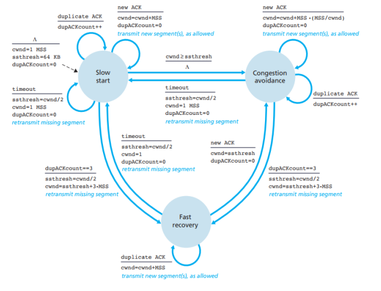

# TCP Reliable Data Transport Protocol
Here's our own implementation for Reliable Transport Protocol which used in transport layers.

*Reliable transport protocol runs on top of an unreliable delivery mechanism.*

## RDT methods
### Stop and Wait
Simply, the server sends only one packet until it receives the successful acknowledgement from the client.

### Selective Repeat
Implementation for one of the most common pipelining methods, where the server sends up to N packets with associated timers for each individual packet. 
This method is practical as it doesn't work by `cumulative acknowledgements` like **GBN**, mentioned later. Otherwise, it only sends unacknowledged packets.

### Go-Back-In (GBN)
It works like the previous method, except that the whole window has only one timer because it works by `cumulative acknowledgements`, so in case of packet loss, it retransmits the whole window again.

## Error Detection By Checksum
We provide error correction methodology by using checksum to detect most of packet transmission errors. 
We choose to make the checksum of 16 bits as in Internet checksum to make undetected errors very rare, but We can not guarantee
completely error-free delivery because of checksumming’s limitation. 

## Congestion Control
**TCP** is well-known for it's congestion control process as shown in the state diagram shown below.

  

The state diagram shows how the server window size is dynamically changed based on the congestion of the network by using `Additive increase Multiplicative decrease`.

## Packet Loss Simulation
Since we can't modify the local machines with OS, we simualted the packet loss by the following process : 
- The system is given a packet loss propability in the configuration file. This *PLP* ranges from 0 to 1, where PLP% of the packets are considered lost. 
- In addition, a seed value for the random generator is also given to the server to select the indices of lost packets.
- Then simulating packet loss by not calling send method on these selected lost datagrams but start their timers, So these timers will timeout later and a loss will be detected as a result.

## Prerequisite installed
- C++11 or higher compiler.

## How to run

1. Clone the project `git clone https://github.com/AmrHendy/tcp-protocol.git`.

2. Update the configuration files of both server and client.
  * `For Server` you can find the configuration file [here](Server/cmake-build-debug/server.txt) 
    Server Configuration File contains the following: 
    * Server port number.
    * Maximum sending sliding-window size (in datagram units).
    * Random generator seed value (to be used in simulating packet loss).
    * Probability p of datagram loss (to be used also in simulating packet loss) 
  * `For Client` you can find the configuration file [here](Client/cmake-build-debug/client.txt) 
    Client Configuration File contains the following: 
    * IP address of server.
    * Server port number.
    * Client port number.
    * Filename to be transferred.
    * Initial receiving sliding-window size (in datagram units).

3. You can now start transfering the file by running the [server main](Server/serverMain.cpp) and the [client main](Client/clientMain.cpp).

## Authors
* **Amr Hendy** [AmrHendy](https://github.com/AmrHendy)
* **Arsanous Essa** [Arsanous](https://github.com/Arsanuos)
* **Mohammed Deifallah** [Mohammed-Deifallah](https://github.com/Mohammed-Deifallah)

## License
This project is licensed under the MIT License - see the [LICENSE](LICENSE) file for details
